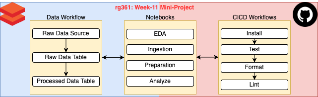
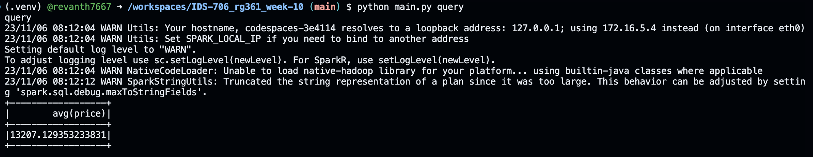
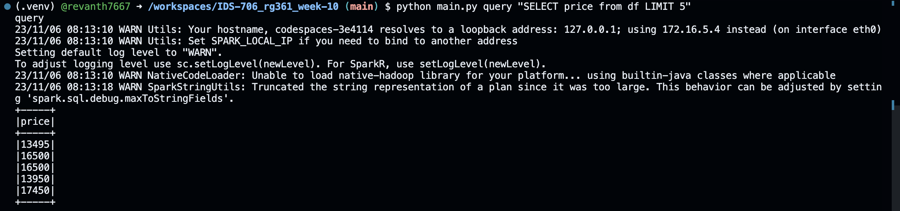
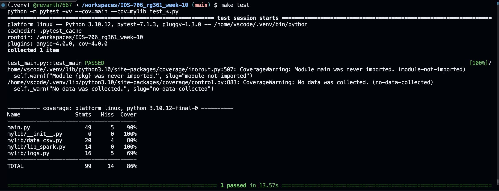
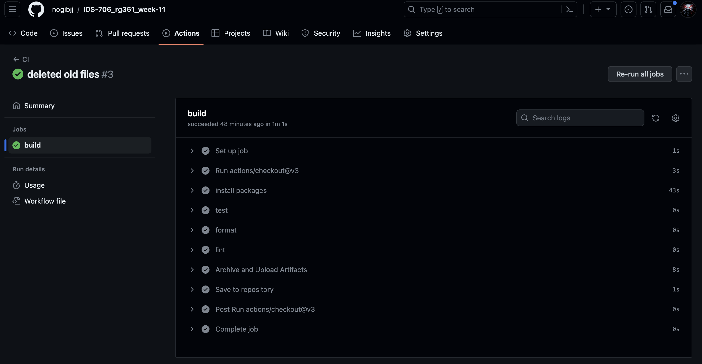

# Data Pipeline in Databricks

[](https://github.com/nogibjj/IDS-706_rg361_week-11/actions/workflows/cicd.yml)

This repositroy contains files to process data in ``Databricks`` using ``PySpark``, ``Python``  and ``SQL``

The repo has been created from [Week-10 Mini-Project](https://github.com/nogibjj/IDS-706_rg361_week-10) and modified as per requirements.

Created on on 08-Nov-2023

## Overview

This project performs a sample End-to-End Data Pipeline in Databricks.
The sample data is loaded from Databricks and the notebooks used for processing are saved in this Github Repository in the ``Notebooks`` folder.

A Databricks ``workflow`` is setup to run the notbooks in sequence to simulate the End-to-End workflow.

``Github`` actions automatically performs the ``CICD`` workflows whenever there is a change in the repository.



## Instructions

The Primary data and operations happen in the Databricks platform.

We use the ``million songs`` sample dataset available in databricks for this process.


```console
python main.py command args
```
the possible commands and their relevant arguments are:
1. ``create_data``: To create CSV file in the ``Data`` folder from the given source.<br>Args: (source, file_name, auto)
2. ``delete_data``: To delete the CSV file.<br>Args: (file_name, auto)
3. ``clear_log``: To clear the query_logs file.<br>Args: (log_file)
4. ``query``: Query to execute on the Dataset using PySpark

**Notes:** 
- All the arguments to the commands are optional as default values are set in the functions.
- The "auto" argument specfies to the function if the user is directly providing the full path (F) or wants the funtion to use the default path (T). Default value for auto is T

## Sample Execution and Test
  **Sample Execution:** 
  1. Query command is used without any arguments, so the average of the price column is returned:

   

  2. Custom Query is passed and returns the expected results:
  
     
   
**Testing:** "make test" command is run to verify all functionalities are working as expected and to see if the operations are being performed.

**Note:** Coverage is intentioanlly not kept at 100% as we do not call the clear_log funtion which would clear the logs.




## Contents

### 1. query_logs
  Whenever a  PsSpark operation is performed, the query is automatically logged in the query_logs file with the timestamp for future reference and use. The log file can be cleared using the ``clear_log`` command

### 2. README.md
   contains the information about the repository and instructions for using it
   
### 3. requirements.txt
   contains the list of packages and libraries which are required for running the project. These are intalled and used in the virtual environment and Github actions.
   
### 4. .github/workflows
   github actions are used to automate the following processes whenever a change is made to the files in the repository:
   - ``install`` : installs the packages and libraries mentioned in the requirements.txt
   - ``test`` : uses ``pytest`` to test the python script
      
      **Note:** this action automatically triggers the sample operations whenever any changes are made in the repository
     
   - ``format`` : uses ``black`` to format the python files
   - ``lint`` : uses ``ruff`` to lint the python files
   
     
   **Note** -if all the processes run successfully the following output will be visible in github actions:
   
   
### 5. Makefile
   contains the instructions and sequences for the processes used in github actions and .devcontainer for creating the virtual environment
   
### 6. .devcontainer
   contains the ``dockerfile`` and ``devcontainer.json`` files which are used to build and define the setting of the virtual environment (codespaces - python) for running the codes.

### 7. Data
   The CSV files genereated by ``create_data`` are stored here by default for quick access and reference and can be delted using the ``delete_data`` command

### 8. resources 
   contains additonal files which are used in the README


  
